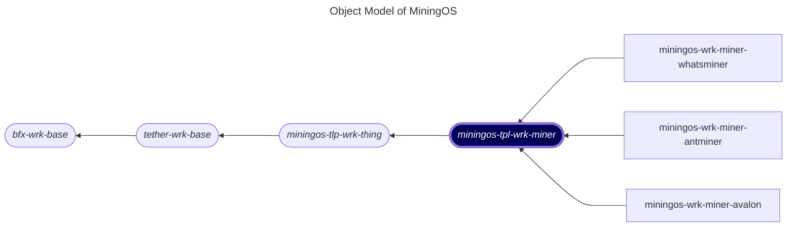

# miningos-tpl-wrk-miner

## Table of Contents

1. [Overview](#overview)
2. [Architecture](#architecture)
3. [Miner Worker Implementation](#miner-worker-implementation)

## Overview

The miner worker system is built on a hierarchical class structure designed to manage and control mining devices in a distributed infrastructure. This documentation covers the abstract class hierarchy and key implementations for the miner worker system.

## Architecture

The following is a fragment of [MiningOS object model](https://docs.mos.tether.io/) that contains the abstract class representing **Miner** (highlighted in blue). The rounded nodes reprsent abstract classes and the square nodes represent a concrete classes:



Check out concrete implementations of Miner here:
- [miningos-wrk-miner-avalon](https://github.com/tetherto/miningos-wrk-miner-avalon)
- [miningos-wrk-miner-whatsminer](https://github.com/tetherto/miningos-wrk-miner-whatsminer)
- [miningos-wrk-miner-antminer](https://github.com/tetherto/miningos-wrk-miner-antminer)

#### Key Methods:
- init(): Initializes storage and network facilities
- getRpcKey(): Returns the RPC server public key
- getRpcClientKey(): Returns the RPC client public key
- _startRpcServer(): Starts the RPC server
- _start(cb): Starts the worker with RPC endpoints

#### Configuration:
- Sets up storage directory based on environment
- Configures logging with Pino
- Initializes network facilities for RPC communication

#### Methods to be overridden by children classes:
- getThingType(): Returns the type of thing (e.g., 'miner')
- getThingTags(): Returns default tags for the thing type
- selectThingInfo(): Selects additional info to include in responses
- collectThingSnap(thg): **(Must be overridden: original implementation throws error)** Collects a snapshot of the thing's current state
- connectThing(thg): Establishes connection to the thing
- disconnectThing(thg): Disconnects from the thing

#### Lifecycle Hooks:
- registerThingHook0(thg): Called when registering a new thing
- updateThingHook0(thg, thgPrev): Called when updating a thing
- forgetThingHook0(thg): Called when removing a thing
- setupThingHook0(thg): Called during thing setup

#### Core Features:

##### Thing Management:
- Registration: Add new devices to the system
- Updates: Modify device configuration and info
- Deletion: Remove devices from management
- Querying: Search and filter devices

##### Data Collection:
- Periodic snapshot collection
- Historical data logging (5-minute intervals)
- Alert processing based on snapshots

##### RPC Endpoints:
- getRack: Get rack information
- queryThing: Query individual thing methods
- listThings: List all managed things
- registerThing: Register new thing
- updateThing: Update existing thing
- forgetThings: Remove things
- applyThings: Apply methods to multiple things
- tailLog: Retrieve historical logs

## Miner Worker Implementation

### WrkMinerRack
- **Source**: `rack.miner.wrk.js`
- **Extends**: `WrkProcVar`
- **Purpose**: Concrete implementation for managing mining devices

#### Miner-Specific Features:

##### IP Address Management:
- Static IP assignment support
- Dynamic IP allocation 
- IP release on device removal or maintenance

##### Validation:
- Prevents duplicate serial numbers
- Prevents duplicate MAC addresses
- Prevents duplicate container positions
- Prevents duplicate IP addresses

##### Miner Properties:
```javascript
{
  opts: {
    address: string,    // IP address
    port: number,       // Connection port
    forceSetIp: boolean // Force IP assignment
  },
  info: {
    serialNum: string,  // Device serial number
    macAddress: string, // Network MAC address
    pos: string,        // Position in container
    container: string,  // Container ID
    location: string    // Physical location
  }
}
```
